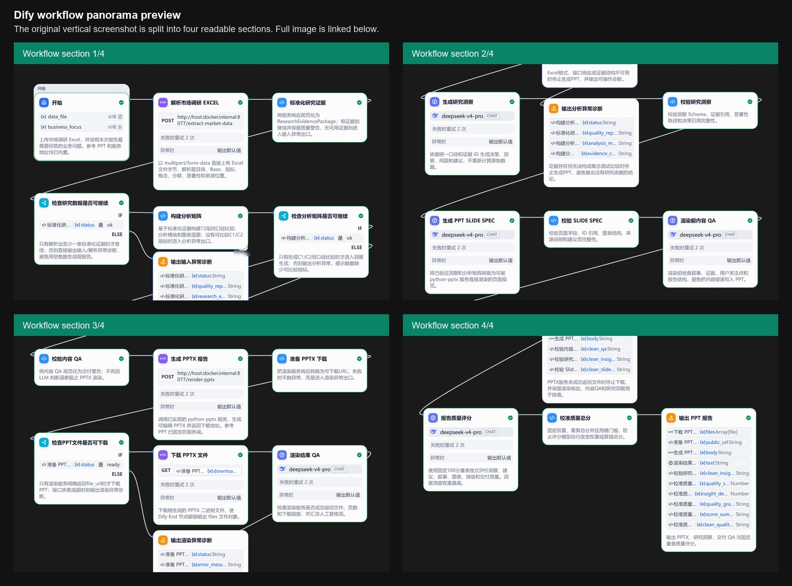
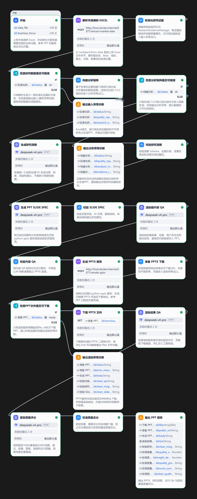

# Dify AI Market Research PPT Workflow

This repository is a sanitized portfolio demo of an AI product workflow built with Dify. It turns a concept-testing Excel workbook into a traceable evidence package, generates research insights and a structured Slide Spec, runs content QA, and renders an editable PowerPoint report.

All demo data in this repository is synthetic and desensitized. It does not include real client names, product names, brand names, original research values, or confidential conclusions.

## Demo Materials

| Material | File |
|---|---|
| 1-2 minute run recording | [assets/demo-recording.mp4](assets/demo-recording.mp4) |
| Dify workflow overview | [assets/dify-workflow-overview.jpeg](assets/dify-workflow-overview.jpeg) |
| Sample input file | [sample_input/synthetic_concept_test_data.xlsx](sample_input/synthetic_concept_test_data.xlsx) |
| Final generated PPT | [sample_output/generated_demo_market_research_report.pptx](sample_output/generated_demo_market_research_report.pptx) |

<video src="assets/demo-recording.mp4" controls width="900"></video>



<details>
<summary>View the full vertical Dify workflow screenshot</summary>



</details>

## What This Demonstrates

- AI product workflow decomposition: the report-writing process is split into Excel parsing, evidence standardization, analysis matrix construction, insight generation, Slide Spec generation, content QA, PPTX rendering, and download delivery.
- Data-driven reasoning: the workflow extracts up to 600 standardized evidence records and builds 72 concept/audience/metric comparisons.
- AI capability-boundary design: LLM nodes focus on insight synthesis and narrative design, while deterministic code handles parsing, schema validation, evidence IDs, fallback logic, and PPTX rendering.
- Structured output design: JSON Schema-style contracts are used between nodes to keep the workflow auditable and reusable.
- End-to-end delivery: the system produces an editable 12-slide PowerPoint report from a spreadsheet input.

## Test Run Included In This Repo

Business Focus used for the demo run:

```text
Focus on Concept A and Concept B purchase intent, clarity, value perception, and optimization direction.
```

Key test outputs:

| Metric | Result |
|---|---:|
| Standardized evidence records | 600 |
| Analysis comparisons | 72 |
| Generated PPT slides | 12 |
| Dify workflow nodes | 23 |
| Workflow code-node validation | Passed |
| PPTX render and download | Passed |

## Architecture


## Repository Structure

```text
.
|-- README.md
|-- assets/
|   |-- demo-recording.mp4
|   |-- dify-workflow-overview.jpeg
|   `-- dify-workflow-full.jpeg
|-- sample_input/
|   `-- synthetic_concept_test_data.xlsx
|-- sample_output/
|   `-- generated_demo_market_research_report.pptx
|-- workflow/
|   `-- generic_market_research_ppt_workflow.yml
|-- services/
|   `-- pptx_author_tool/
|       |-- server.py
|       |-- extractor.py
|       |-- renderer.py
|       |-- requirements.txt
|       |-- validate_workflow.py
|       |-- workflow_integration_test.py
|       `-- smoke_test.py
`-- reference_template.pptx
```

## How To Review The Demo

1. Watch `assets/demo-recording.mp4` to see the Dify workflow run from input to PPT download.
2. Open `assets/dify-workflow-overview.jpeg` to inspect the workflow at a glance, or expand the full screenshot in the README for detailed node-level review.
3. Open `sample_input/synthetic_concept_test_data.xlsx` to review the desensitized input structure.
4. Open `sample_output/generated_demo_market_research_report.pptx` to inspect the final editable report.
5. Inspect `workflow/generic_market_research_ppt_workflow.yml` to see the 23-node Dify workflow definition.
6. Inspect `services/pptx_author_tool/` to see the deterministic Excel parsing and PPTX rendering service.

## Local Verification

Install dependencies:

```powershell
python -m pip install -r services/pptx_author_tool/requirements.txt
```

Validate the Dify DSL file:

```powershell
python services/pptx_author_tool/validate_workflow.py workflow/generic_market_research_ppt_workflow.yml
```

Run the local integration test:

```powershell
python services/pptx_author_tool/workflow_integration_test.py workflow/generic_market_research_ppt_workflow.yml
```

Start the local tool service for Dify:

```powershell
python services/pptx_author_tool/server.py --host 0.0.0.0 --port 8077
```

Health check:

```text
http://localhost:8077/health
```

The workflow HTTP tool nodes are configured for a local Dify/Docker setup:

```text
http://host.docker.internal:8077/extract-market-data
http://host.docker.internal:8077/render-pptx
```

## What To Upload To GitHub

Upload this entire sanitized folder only:

```text
market-research-dify-ppt-showcase-public/
```

Do not upload any original internal files, especially:

```text
internal-client-showcase-folder/
internal-client-showcase.zip
original_internal_workflow.yml
original_internal_cloud_workflow.yml
original_internal_market_research_data.xlsx
original_internal_reference_report.pptx
concept_test_data.xlsx or any original internal workbook
outputs/ generated from internal runs
*.log
```

## Privacy Note

The Excel and PPTX files in this repository are demo artifacts generated from synthetic data. They preserve the workflow shape and technical behavior, but they do not preserve real business values, internal product copy, or client-specific conclusions.
